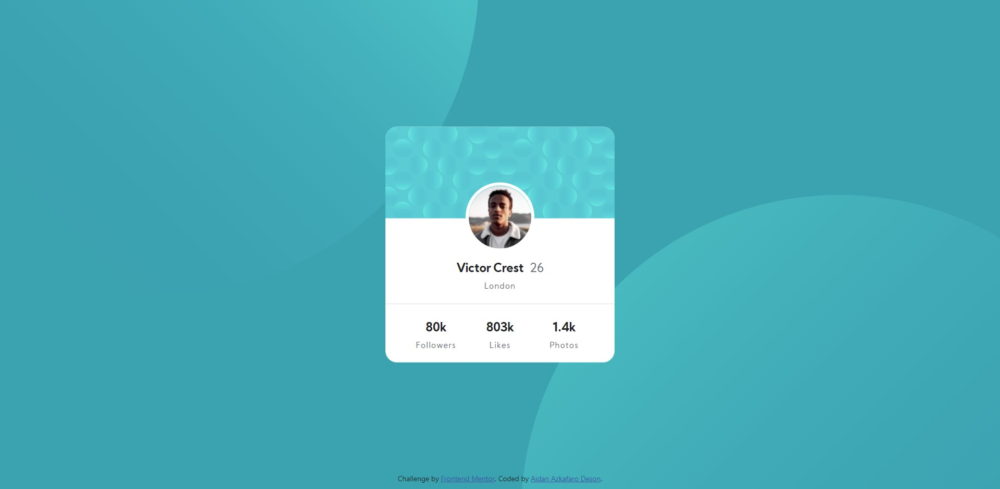

# Frontend Mentor - Profile card component solution

This is a solution to the [Profile card component challenge on Frontend Mentor](https://www.frontendmentor.io/challenges/profile-card-component-cfArpWshJ). Frontend Mentor challenges help you improve your coding skills by building realistic projects. 

## Table of contents

- [Overview](#overview)
  - [The challenge](#the-challenge)
  - [Screenshot](#screenshot)
  - [Links](#links)
- [My process](#my-process)
  - [Built with](#built-with)
  - [What I learned](#what-i-learned)
  - [Continued development](#continued-development)
- [Author](#author)

## Overview

### The challenge

- Build out the project to the designs provided

### Screenshot




### Links

- Solution URL: [Add solution URL here](https://your-solution-url.com)
- Live Site URL: [Add live site URL here](https://your-live-site-url.com)

## My process

### Built with

- Semantic HTML5 markup
- CSS custom properties
- [Bootstrap 5](https://getbootstrap.com/docs/5.0/getting-started/introduction/) - Bootstrap Framework
- [Kumbh Sans font from Google Fonts](https://fonts.google.com/specimen/Kumbh+Sans) - For the fonts

### What I learned

I used some of the bootstrap 5 columns classes in this project. I also learned about centering a div with transform method to put the profile card in the middle of the screen. I applied CSS Z index concept to make the circle patterns on the background appear below the profile card.

```css
.card{
    border-radius: 5%;
    overflow: hidden;
    border: 0;
    position: absolute;
    left: 50%;
    top: 50%;
    transform: translate(-50%, -50%);
}
```

```css
style="z-index: -1; position: absolute; bottom: 300px;right: 800px;"
```


### Continued development

Just realized that life is way easier with bootstrap😂. I'm going to explore more about other bootstrap features. After that, I will start putting javascript on my projects.

## Author

- Website - [Aidan Azkafaro Deson](https://www.linkedin.com/in/aidan-azkafaro-deson-0323221b7/)
- Frontend Mentor - [@aidanazkafaro](https://www.frontendmentor.io/profile/aidanazkafaro)
- Twitter - [@Azkafaro25](https://www.twitter.com/Azkafaro25)
- Instagram - [@aidanazk_] (https://www.instagram.com/aidanazk_/)

